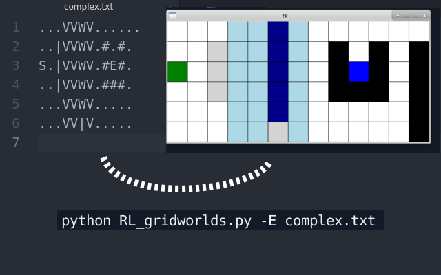

# RL_gridworlds
User friendly code to track Reinforcement Learning algorithms at work in a set of simple gridworld environments. Has a simple interpreter for creating own environments via plain text. Contains several playgrounds based on the Example 6.5 and Exercise 6.6 from the book "Reinforcement Learning:an introduction" by Sutton and Barto. Implemented variants of SARSA and Q-learning algorithms.

## How to start?
To start an agent learning an environment just run
```
python RL_gridworlds.py
```
which runs a SARSA algorithm on a [envs/simple.txt] environment.

### What is going on?
Agent starts on the green cell and has to find a way to the blue field where he receives a reward. Each movement gives a penalty of -1 and so agent is incentivized to find the shortest path. Agent can either move in four NSEW (basic) or eight (King's) directions. 

Four (or eight) arrows located at the center of each cell depict the possible actions with their probabilities encoded in arrows' sizes. An actual trajectory chosen by the agent is shown by a thick red line; the most recent track is redrawn each time after 40 iterations and fully drawn when reaching the final tile.

## Options
All available options are found through
```
python RL_gridworlds.py --help
```

## Own environments
<p align="center">

</p>
Since environment data is stored in plain text files, there is an easy way of generating own playgrounds by putting them in **envs** dir and running the script with [-E filename]. Available blocks are listed below:

Apart from mandatory blocks:
- **S** the start block (reward -1; green)
- **E** the finish or end block (reward 10; blue)
- **.** plain block (reward -1; white color)

There are additional tiles available:
- **V** weak south wind, moves one tile (reward -1; lightblue)
- **W** strong south wind, moves two tiles (reward -1; darkblue)
- **#** wall, cannot explore (reward -1; black)
- **|** cliff, moves back to S (reward -100; gray)

## Algorithms

There are three algorithms implemented
* SARSA
* SARSA(LAMBDA)
* Q-Learning

## Examples
In the **examples** directory working examples are provided.

- *SARSA_lambda*

Explore the SARSA(LAMBDA) algorithm as a function of the lambda parameter which measures how much into the future our algorithm looks. To run:
```
./SARSA_lambda.sh
```

- *comparison*

Compare all algorithms. To run:
```
./comparison.sh
```
